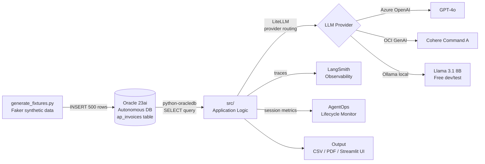

# Architecture

## Pipeline Flow

## Components

### Data Layer
- **Oracle Autonomous Database 23ai** — all data stored here
- **python-oracledb 2.x** — connects Python to Oracle via wallet-based mTLS
- **Faker** — generates realistic synthetic AP invoice data
- **pandas** — reads Oracle results into DataFrames for analysis

### LLM Layer
- **LiteLLM** — single API routing between Azure OpenAI, OCI GenAI, and Ollama
- Swap providers by changing one environment variable — no code changes needed
- Ollama for zero-cost development, Azure OpenAI / OCI GenAI for client demos

### Observability Layer
- **LangSmith** — traces every LLM call and agent step. Free 5K traces/month
- **AgentOps** — tracks session-level metrics across all runs
- **Langfuse** — prompt version management (prompts versioned separately from code)

### Application Layer
- **src/** — all business logic lives here
- **main.py** — entry point that orchestrates the pipeline
- **tests/** — pytest tests that run without a live Oracle connection

## Design Decisions

<!-- Add these after building each repo -->

| Decision | Reason |
|----------|--------|
| Wallet-based connection | mTLS required by Oracle Autonomous DB |
| LiteLLM over direct OpenAI | Provider-agnostic for data-residency clients |
| Synthetic data via Faker | No real client data in public repos |
| executemany for inserts | Single round-trip vs 500 separate inserts |

## Deployment Options

| Platform | Use Case | Time to Deploy |
|----------|----------|----------------|
| Local + Ollama | Development and testing | 0 cost, immediate |
| Docker | Client on-premise delivery | 30 minutes |
| Azure AI Foundry | Oracle on Azure clients | 2-3 hours |
| Bedrock AgentCore | Oracle on AWS clients | 2-3 hours |
| LangGraph Platform | Framework-native managed | Minutes |

## Results

<!-- Fill in after building and testing -->

| Metric | Value |
|--------|-------|
| Records processed | 500 invoices |
| Processing time | TBD |
| AI narrative time | TBD |
| Cost per run (GPT-4o) | TBD |
| Cost per run (Ollama) | $0.00 |

## Lessons Learned

<!-- Fill in after building — what was technically hard,
what surprised you about Oracle REST or python-oracledb,
what you would do differently next time -->
